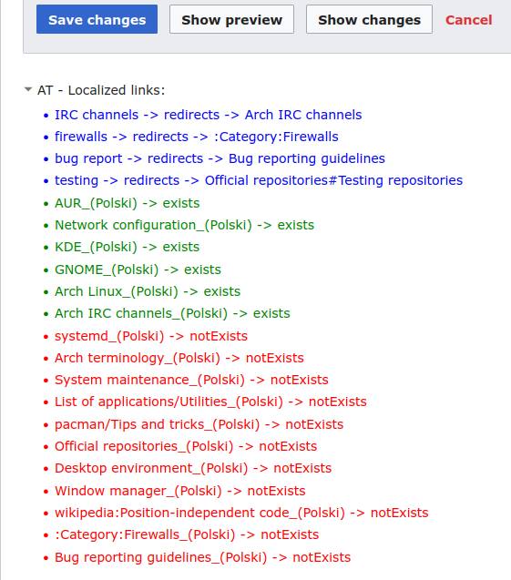

# ArchTranslator
Scripts to make translating ArchWiki easier. This script assumes that you are translating from English to Polish.

## Usage
Change LOCALIZED_LANG_NAME to your own language before use.

## Features
- Copies and pastes the original source;
- Inserts the [localized] ic|TranslationStatus template;
- Inserts the English interlanguage link;
- Sorts the header elements according to the ArchWiki layout.
- Checks whether any of the linked English versions of articles have already been translated

### Localized links scanner
The script scans the article for links to other articles and checks if these articles have
been already translated to language of choice. It keeps the search results in local 
cache for 6 hours by default. 

For example, this page contains many links to English (original) articles. The script
found out that: AUR, Network configuration etc. have Polish translations while the red
ones do not:

## Working on
- Support for multiple languages (mainly the localized link caching)
- More reliable edit mods initialization (sometimes they trigger too soon, before the MediaWiki API is available)
