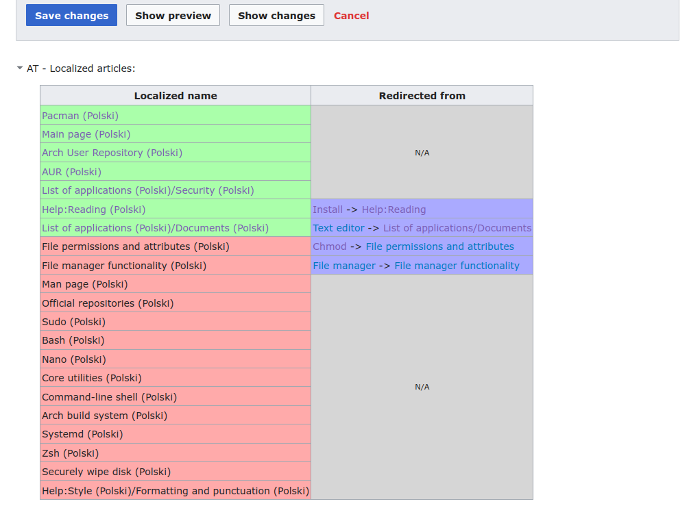

# ArchTranslator

Useful tools for ArchWiki translators, now written in TypeScript.

## Usage
- Install the UserScript
- Change the active language (the default is Polish)

## Build
You can build the script yourself:

Remember to install the dev dependencies:
`npm install`

Single build:
`npm run build`

Build on change:
`npm run watch`

The three (two usable) files will be in the `build/` directory:
- `arch-translator.user.js` - ready to use UserScript
- `arch-translator.srcmap.user.js` - ready to use UserScript but with inlined sourcemap
- `arch-translator.js` - raw output from [esbuild](https://esbuild.github.io/) 
(no UserScript header)

## Features
- Copies and pastes the original source;
- Inserts the localized {{TranslationStatus}} template;
- Inserts the English interlanguage link;
- Sorts the header elements according to the ArchWiki style;
- Scans the page content for already translated articles.

### Translated articles scanner
The script scans the article for links to other articles and checks if these articles have
been already translated to the language of choice.

In this [example](https://wiki.archlinux.org/index.php?title=Wireshark_(Polski)&action=edit) we can see that the page content contains many links to English pages.
Pages highlighted in green have a translation page.

